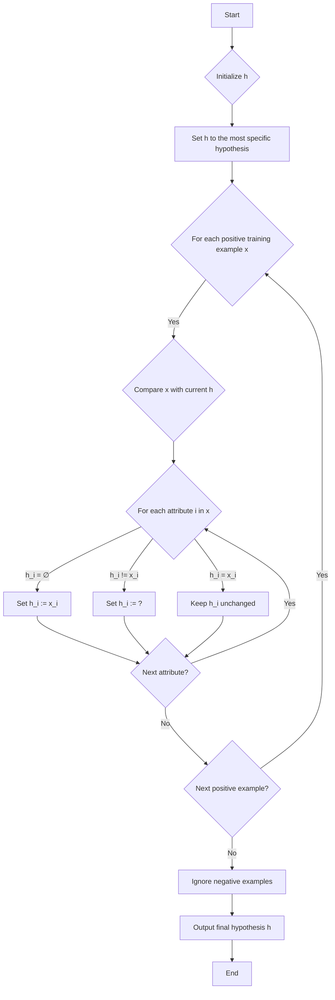

# Experiment 1

## Lesson Objectives
- Understand the basics of concept learning and hypothesis spaces in ML.
- Learn the FIND-S algorithm: its purpose, steps, and limitations.
- Implement FIND-S in Python using Jupyter Notebook, with data loaded from a CSV file.
- Evaluate the hypothesis generated and discuss its practical applications.
- Gain hands-on experience through the integrated experiment.

## Prerequisites
- Basic Python programming (lists, loops, file handling).
- Familiarity with Jupyter Notebook (since you're using it—great choice for interactive ML experimentation!).
- Installed libraries: Pandas (for CSV reading) and NumPy (optional for data manipulation). Install via `!pip install pandas numpy` in your Jupyter cell if needed.
- No prior ML knowledge required; we'll build from basics.

## Theoretical Background: 
### Concept Learning and Hypothesis Spaces

### What is Concept Learning?
Concept learning is a subfield of machine learning where the goal is to identify a "concept" (a rule or pattern) from examples. Imagine teaching a child to recognize "birds": you show positive examples (eagle, sparrow) and negative ones (bat, airplane). The child learns a hypothesis like "has wings and feathers."

In Machine Learning (ML) terms:

* **Instances** $(X)$:
  The set of input data samples. Each instance $x \in X$ is described by a set of attributes (features).

* **Target Concept** $(c)$:
  The unknown function we are trying to learn. For binary classification:

  $$
  c: X \rightarrow \{0, 1\}
  $$

  where $c(x) = 1$ indicates a *positive* instance and $c(x) = 0$ a *negative* instance.

* **Hypothesis** $(h)$:
  A proposed function that approximates the target concept:

  $$
  h: X \rightarrow \{0, 1\}
  $$

  where $h \approx c$, meaning the hypothesis tries to closely match the true labels given by $c$.

* **Hypothesis Space** $(H)$:
  The set of all possible hypotheses that can be considered, based on the representation language or model class:

  $$
  H = \{ h \mid h: X \rightarrow \{0,1\} \}
  $$

* **Training Examples**:
  A set of labeled data points:

  $$
  D = \{ \langle x_1, c(x_1) \rangle, \langle x_2, c(x_2) \rangle, \dots, \langle x_n, c(x_n) \rangle \}
  $$

  where each $x_i \in X$ is an instance, and $c(x_i) \in \{0,1\}$ is its label.

---

### The FIND-S Algorithm
FIND-S (Find Specific) is a simple, greedy algorithm for concept learning. It finds the **most specific hypothesis** that fits all positive training examples. It ignores negative examples, assuming the hypothesis space is conjunctive (AND-based rules) and there's no noise in data.

**Key Points**:

*   **Concept Learning**: A learning problem where the system learns to identify or classify an object or pattern based on examples.
*   **Most Specific Hypothesis**: The most specific hypothesis is the one that matches only the training examples provided, i.e., it doesn’t generalize too much.

**Key Assumptions:** 
- The target concept is in the hypothesis space (representable as conjunctions of attribute values).
- Data is noise-free and consistent.
- Attributes are discrete (categorical).

**Hypothesis Representation:**
A hypothesis $h$ is a conjunction of constraints on attributes. Each attribute $A_i$ can take a specific value $v_i$, a wildcard `?` (meaning "any value"), or `∅` (meaning "no value" or "empty").
$$
h = \langle A_1, A_2, \ldots, A_n \rangle
$$
where $A_i \in \{v_i, ?, \emptyset\}$.

*   `?` → any value (**generalization**)
*   `∅` or specific value → **constraint**

Example (Attributes: `[Color, Shape]`):

*   `["Red", "Circle"]` → Red **AND** Circle
*   `["?", "Circle"]` → Any color, but **must be** Circle
*   `["Red", "?"]` → Must be Red, any shape
*   `["?", "?"]` → Any color and any shape (most general)
*   `["∅", "Circle"]` → Matches nothing (inconsistent)

---

## FIND-S Algorithm Steps

Here's a flowchart illustrating the FIND-S algorithm:



1.  **Initialize** the hypothesis $h$ to the most specific possible. This can be done in two ways:

    *   Set $h$ to a vector of empty constraints:
        $$
        h = \langle \emptyset, \emptyset, \ldots, \emptyset \rangle
        $$
    *   Alternatively, set $h$ to the first positive training example $x_1$ (excluding its target label):
        $$
        h = \langle x_{1,1}, x_{1,2}, \ldots, x_{1,n} \rangle
        $$

2.  **For each** positive training example $x = \langle x_1, x_2, \ldots, x_n \rangle$:

    *   Compare $x$ with the current hypothesis $h = \langle h_1, h_2, \ldots, h_n \rangle$.

    *   For each attribute $i$ from $1$ to $n$:
        *   If $h_i = \emptyset$ (uninitialized), set $h_i := x_i$.
        *   Else if $h_i \neq x_i$ (mismatch), set $h_i := ?$ (generalize).
        *   Else ($h_i = x_i$, match), keep $h_i$ unchanged.

    This update rule can be summarized as:
    $$
    h_i \leftarrow
    \begin{cases}
        x_i & \text{if } h_i = \emptyset \\
        ? & \text{if } h_i \neq x_i \text{ and } h_i \neq \emptyset \\
        h_i & \text{if } h_i = x_i
    \end{cases}
    $$

3.  **Ignore negative examples.**
    FIND-S does not consider them; it only focuses on generalizing over positive instances.

4.  **Output** the final hypothesis $h$, which is the most specific one that covers all positive examples.

### Example

Given three attributes, the initial hypothesis might be:

$$
h = \langle \emptyset, \emptyset, \emptyset \rangle
$$

After processing positive examples, it could evolve to something like:

$$
h = \langle \text{Sunny}, ?, \text{High} \rangle
$$

---
## Limitations of FIND-S Algorithm

- **Cannot handle noise or inconsistent data:**  
  FIND-S assumes all positive examples are correct and consistent, so it fails if data contains errors.

- **Finds only the most specific hypothesis:**  
  It does not explore or find all possible hypotheses that fit the data, limiting generalization.

- **Incomplete without other algorithms:**  
  For completeness, FIND-S is often paired with algorithms like **LIST-THEN-ELIMINATE** or the **Candidate Elimination Algorithm (CEA)**,  
  which maintain a **version space** — the set of all hypotheses consistent with the data.

---

## Implementing FIND-S in Jupyter Notebook

### Step 1: Prepare Your Jupyter Notebook Environment
- Open Jupyter Notebook (via Anaconda or command line: `jupyter notebook`).
- Create a new notebook named "FIND-S_Experiment.ipynb".
- In the first cell, import necessary libraries:
  ```python
  import pandas as pd
  ```


```python
import pandas as pd
```

### Step 2: Implement the FIND-S Algorithm (Code)

#### Cell 1: Load the Data


```python
# Load the CSV file
data = pd.read_csv('enjoysport.csv')

# Display the data for verification
print("Training Data:")
print(data)
# Extract attributes (exclude target) and target
attributes = data.columns[:-1]  # All columns except the last
target = data.columns[-1]

# Convert to list of lists for easier processing
instances = data.values.tolist()

# Separate positive examples (only process these)
positive_examples = [inst for inst in instances if inst[-1] == 'Yes']

print("\nPositive Examples:")
for ex in positive_examples:
    print(ex)
```

    Training Data:
         Sky AirTemp Humidity    Wind Water Forecast EnjoySport
    0  Sunny    Warm   Normal  Strong  Warm     Same        Yes
    1  Sunny    Warm     High  Strong  Warm     Same        Yes
    2  Rainy    Cold     High  Strong  Warm   Change         No
    3  Sunny    Warm     High  Strong  Cool   Change        Yes
    
    Positive Examples:
    ['Sunny', 'Warm', 'Normal', 'Strong', 'Warm', 'Same', 'Yes']
    ['Sunny', 'Warm', 'High', 'Strong', 'Warm', 'Same', 'Yes']
    ['Sunny', 'Warm', 'High', 'Strong', 'Cool', 'Change', 'Yes']
    

> - Columns: Attributes + Target (EnjoySport: Yes/No).
> - Positive examples: Rows where EnjoySport = "Yes".
> - Negative: "No" (ignored in FIND-S).

> Explanation: Attributes describe weather; target is whether to enjoy the sport (e.g., water rafting).


> **Explanation**:
> - We use Pandas to read the CSV effortlessly.
> - `positive_examples` filters only "Yes" rows, as FIND-S ignores negatives.
> - Output: Shows the data to ensure correctness.

#### Cell 2: Implement FIND-S


```python
# Initialize the most specific hypothesis
# Assume attributes are categorical; start with first positive example
if not positive_examples:
    print("No positive examples found!")
else:
    # Start with the first positive example (exclude target)
    hypothesis = positive_examples[0][:-1]
    print("\nInitial Hypothesis:", hypothesis)

    # Process each subsequent positive example
    for example in positive_examples[1:]:
        example_attrs = example[:-1]  # Exclude target
        for i in range(len(hypothesis)):
            if hypothesis[i] != example_attrs[i]:
                hypothesis[i] = '?'  # Generalize to any value
        print("Updated Hypothesis after example", example, ":", hypothesis)

    # Final hypothesis
    print("\nMost Specific Hypothesis:")
    for attr, val in zip(attributes, hypothesis):
        print(f"{attr}: {val}")
```

    
    Initial Hypothesis: ['Sunny', 'Warm', 'Normal', 'Strong', 'Warm', 'Same']
    Updated Hypothesis after example ['Sunny', 'Warm', 'High', 'Strong', 'Warm', 'Same', 'Yes'] : ['Sunny', 'Warm', '?', 'Strong', 'Warm', 'Same']
    Updated Hypothesis after example ['Sunny', 'Warm', 'High', 'Strong', 'Cool', 'Change', 'Yes'] : ['Sunny', 'Warm', '?', 'Strong', '?', '?']
    
    Most Specific Hypothesis:
    Sky: Sunny
    AirTemp: Warm
    Humidity: ?
    Wind: Strong
    Water: ?
    Forecast: ?
    

**Explanation** (Step-by-Step):
- **Initialization**: Set `hypothesis` to the attributes of the first positive example (e.g., ['Sunny', 'Warm', 'Normal', 'Strong', 'Warm', 'Same']).
- **Iteration**: For each next positive example:
  - Compare attribute-by-attribute.
  - If mismatch, replace with "?" (e.g., if Humidity differs, set to "?").
- **Output**: The final hypothesis, e.g., ['Sunny', 'Warm', '?', 'Strong', '?', '?'] meaning "Sunny AND Warm AND Strong AND (any Humidity, Water, Forecast)".
- This matches the algorithm: It generalizes only as needed to cover all positives, staying as specific as possible.

Run the cells sequentially. Expected Output:
- Initial: ['Sunny', 'Warm', 'Normal', 'Strong', 'Warm', 'Same']
- After second: ['Sunny', 'Warm', '?', 'Strong', 'Warm', 'Same']
- After third: ['Sunny', 'Warm', '?', 'Strong', '?', '?']
- Final: Same as above (since only three positives).


### Step 4: Evaluate the ML Model (Hypothesis)
FIND-S isn't a predictive model like classifiers, but we can "evaluate" it by:
- **Consistency Check**: Apply the hypothesis to training data. For a new instance, if it matches the specific parts (ignoring ?), predict positive.
- **Generalization Test**: Create test data (e.g., add to CSV) and see if it correctly classifies.
- Metrics: Since it's binary, compute accuracy on hold-out data. But note: FIND-S overfits to positives; real evaluation needs negatives (use CEA for boundaries).


```python
  # Simple evaluation: Check consistency with all data
  def predict(hypothesis, instance):
      for h_val, i_val in zip(hypothesis, instance):
          if h_val != '?' and h_val != i_val:
              return 'No'
      return 'Yes'

  print("\nPredictions on Training Data:")
  for inst in instances:
      pred = predict(hypothesis, inst[:-1])
      actual = inst[-1]
      print(f"Instance: {inst[:-1]}, Predicted: {pred}, Actual: {actual}")
```

    
    Predictions on Training Data:
    Instance: ['Sunny', 'Warm', 'Normal', 'Strong', 'Warm', 'Same'], Predicted: Yes, Actual: Yes
    Instance: ['Sunny', 'Warm', 'High', 'Strong', 'Warm', 'Same'], Predicted: Yes, Actual: Yes
    Instance: ['Rainy', 'Cold', 'High', 'Strong', 'Warm', 'Change'], Predicted: No, Actual: No
    Instance: ['Sunny', 'Warm', 'High', 'Strong', 'Cool', 'Change'], Predicted: Yes, Actual: Yes
    

- Output: Should match all positives as "Yes"; negatives might be misclassified if they match the hypothesis (limitation of ignoring negatives).

    > Real-World Evaluation Tip: In practice, use cross-validation, but for FIND-S, it's more educational. Compare with scikit-learn's DecisionTreeClassifier for similar conjunctive learning.

## Practical Applications and Real-World Examples
- **Rule-Based Systems**: In e-commerce, FIND-S-like logic learns user preferences from positive reviews (e.g., "Likes: Red AND Small" for products).
- **Anomaly Detection**: Focus on "normal" (positive) behaviors to define specific rules, ignoring outliers.
- **Bioinformatics**: Learn specific gene patterns from positive disease samples.
- Extension: Modern ML uses FIND-S ideas in inductive logic programming (e.g., in Prolog-based systems) or as a baseline for explainable AI.
- Case Study: In agriculture (relevant to India), use weather data to learn "Crop Success" hypothesis: "Sunny AND Warm AND High Humidity" from successful harvests.
